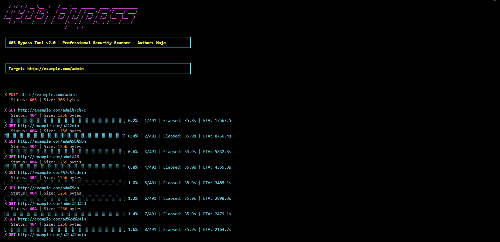

# 403 Bypass Tool

A powerful tool for bypassing 403 Forbidden responses with multiple bypass techniques and professional output display.


## Features

- **Multiple Bypass Techniques**
  - HTTP Method Overriding
  - IP Spoofing
  - URL Rewriting
  - Path Manipulation
  - URL Encoding
  - Double URL Encoding

- **Professional Display**
  - Color-coded status codes
  - Progress tracking
  - Detailed results
  - Scan summary
  - ASCII art banner

- **Advanced Features**
  - Concurrent scanning
  - Retry mechanism
  - Error handling
  - Results saving
  - Multiple target support
    


## Installation

1. Clone the repository:
```bash
git clone https://github.com/trsecu/bypassing-403.git
cd bypassing-403
```

2. Install dependencies:
```bash
pip install -r requirements.txt
```

## Usage

### Basic Usage
```bash
python 403bypasser_Naja.py -u http://example.com -d /admin
```

### Command Line Arguments

| Argument | Description | Example |
|----------|-------------|---------|
| `-u, --url` | Single URL to scan | `-u http://example.com` |
| `-U, --urllist` | Path to list of URLs | `-U urllist.txt` |
| `-d, --dir` | Single directory to scan | `-d /admin` |
| `-D, --dirlist` | Path to list of directories | `-D dirlist.txt` |
| `-t, --threads` | Number of concurrent threads | `-t 20` |

### Examples

1. Scan single URL with single directory:
```bash
python 403bypasser_Naja.py -u http://example.com -d /admin
```

2. Scan multiple URLs with multiple directories:
```bash
python 4403bypasser_Naja.py -U urllist.txt -D dirlist.txt
```

3. Scan with custom thread count:
```bash
python 403bypasser_Naja.py -u http://example.com -d /admin -t 20
```

## Bypass Techniques

### 1. HTTP Method Overriding
- Tests various HTTP method override headers
- Tries different HTTP methods (GET, POST, PUT, etc.)

### 2. IP Spoofing
- Tests multiple IP spoofing headers
- Uses various IP formats (localhost, 127.0.0.1, etc.)

### 3. URL Rewriting
- Tests URL rewrite headers
- Modifies original URL path

### 4. Path Manipulation
- Tests path traversal techniques
- Adds various prefixes and suffixes
- Tests directory traversal

### 5. URL Encoding
- Tests single character URL encoding
- Tests double URL encoding
- Skips forward slashes to maintain path structure

## Output Format

The tool provides detailed output with:
- Color-coded status codes
- Progress bar
- Request details
- Headers used
- Scan summary

### Status Code Colors
- 🟢 200: Bright Green
- 🔵 301/302: Bright Cyan
- 🔴 403: Bright Red
- 🟣 404: Bright Magenta
- 🟡 400-402: Bright Yellow
- 🔴 500-504: Bright Red
- ⚪ Other: Bright White

## Requirements

- Python 3.7+
- aiohttp
- tldextract
- validators
- colorama
- pyfiglet

## License

This project is licensed under the MIT License - see the LICENSE file for details.

## Author

- **Naja**
- GitHub: [@Naja](https://github.com/trsecu)

## Contributing

Contributions are welcome! Please feel free to submit a Pull Request.

## Disclaimer

This tool is for educational purposes only. Use it responsibly and only on systems you have permission to test.
